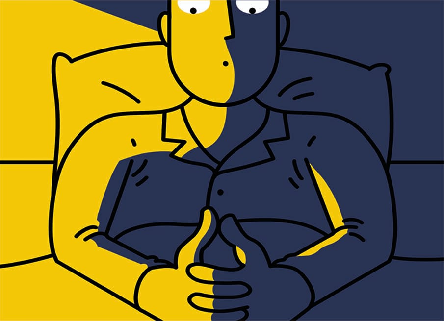

Yesterday I was having a conversation with Samarth, my close friend, where I was just cursing the teacher who punished me for not maintaining a proper notebook. Here, when I use the word “cursing” I want to suggest that I was putting a curse on her while cussing her. In exasperation I wanted to kick a stone near me but I restrained myself.

Now, I find myself lying in my bed staring blankly at the ceiling fan wondering about nothing in particular and yet I am regretful. When suddenly I hear a familiar voice asking me, “Why have you morphed yourself?”

I replied after deriving out whose voice it was, “I thought that it was cool. But now that I think of it, I know it’s a lame answer, as lame as the reason behind every terrorist attack.”

He, continuing with his interrogation, asked me another question “Why did you kill him? Why?!

To which I further inquired “Who are you talking about? Shashwat?!

He replied with a sly smile on his face “You know who I am talking about. No one knows better than you and you cannot lie to me.”

The interrogation was weighing down heavily on me and I could feel the walls of truth closing in. “Gloomy winds hitting my eyes condensing the vapors inviting drops of water and salt”, these words from a famous poem by an unknown poet resonated with my inner turmoil.

My eyes brimmed with tears and my voice croaked.

I said, trying to explain myself, “It all happened with the flow of events in my life. The waves of occurrence sometimes made me soar high and sometimes abandoned me in the crests of oblivion.”

He replied in a calm voice, “Allow these tears to flow and let this moment be a reflection of your true self. Let me take you on a journey into our past and show you who you were. When you were 10-years old you were different, you did not have any pretensions and you were courteous. You respected everyone’s thought, you gave me some thought before you did anything, and I was your friend. Let me remind you who you were. It was the month of March and the school had reopened after long holidays you were both excited and stressed; excited because you were going to meet new friends and stressed because you were going to miss your old classmates. But you never expressed it to anyone. Entered into the classroom whistling, the bag slung across one shoulder and most importantly spikes (hairstyle).

First period had just begun; you were sitting on the first bench looking around the class searching for someone to chat with when suddenly you saw a teacher walking down the corridor with a cast on her left hand and a bag full of a bulk of stuff on her right. Her face revealed a story of a painful incident that left a brutal scar in its wake. You were scared not because of her burned face but because of the stories that were filled in your mind by your classmates of her being an extremely strict teacher. She entered the classroom and all the boys stood up and wished her in a ringing voice, “good morning ma’am”, as if they were asked to sing a song. She asked you all to sit, and said, “Hello students, my name is Mrs Reena Majumdar and I am your new class teacher. I will be teaching you Social Studies and English, although my main subjects are Maths and Science.” She asked everyone to introduce themselves, and when it was your turn, you replied in a sassy manner, “Good morning, ma’am, my name is Shashwat Dubey”. She smiled and replied with a friendly quip, “Good morning, Panditji”. Everyone started laughing including you; if it was the Shashwat of today he would have gotten irritated. Rumors about her being strict proved to be baseless gossip. She was not like any other teacher; she was a mentor and a caring person. In hindsight she was just like a second mother to you. She was such a teacher with whom every student could share their problems even in front of whole class as she had the ability to create an aura of warm comfort which helped the students to trust her with their most intimate issues. She was the one who always had faith in you. Don’t you remember when she stood up for you?”

I thought for a while and replied, “Yes I do remember, it was during the preparatory week of annual function and teachers of lower classes were busy in the rehearsals so a few 5th class students were sent over for monitoring them. I and Mutahir were also selected. We were sent to the 2nd grade, section B, which was on the first floor.

When we entered, we saw that the puckish children were standing on the desks and creating a ruckus. Mutahir made an unsuccessful try to calm them; suddenly, enraged, I screamed, “SHUT UP!” bringing everyone to a standstill, terrified. I tried to behave as if I am a strict senior but I could not realize when monitoring the class turned into bulling. Whenever I heard a murmuring sound, I used to beat the boys with a hard-wooden scale on their forearms. A boy among st them, who was a frail kid, stood up from his seat and started a mutiny against me saying, “No one gave you the right to hit us”. I took the scale and whacked him with annoyance visible on my face. He started sobbing hysterically in pain. Next day a letter came to ma’am’s desk which made her ask me in infuriation, “Shashwat can you explain to me what actually happened yesterday?” I solved the mystery in the very first moment when she said “yesterday”.

In order to save myself I inquired feigning innocence, “Ma’am what?”

She smiled in disgust and said, “Do you actually don’t know what happened?! Come and meet me at the staircase after the class”.

On my way to the stair case I was trying to solve the riddle that who might have snitched about me?

Out of nowhere, ma’am grabbed my collar and said, “I have your suspension letter in my hand.”

My eyes became wider in shock and I was not able to utter a single word.    Ma’am said, “I can help you out with this problem but why should I do it? Should I help you so that you can repeat this blunder?”                                                                                                                                                                        My eyes brimmed with tears and I replied, “Ma’am, I’ll never bully anyone ever again.”

Her face gave away nothing and she continued with her scrutiny. She inquired once again, “Is it a promise?”

I replied, strong willed, “Yes ma’am, I promise!”

Later that day, I was invited to the Principal’s office unceremoniously. The cool breeze from the air-conditioner hits my face, however the aura inside was anything but calm. The kid and his annoyed parents leapt at me with all their allegations and misgivings. They persuaded the Principal, with all their might, to take strict action against me. After listening to them for a while it suddenly dawned on me that I had been summoned to receive my suspension letter and no more. Then ma’am stood up from her seat and said to the Principal that she wanted to talk to the kid’s parents.  She took a stand for me and requested them to take the complaint. I was downcast in my own eyes that day because an upstanding lady was forced to beg for me. In the end they understood and took the complaint back. One more thing happened that day, it transformed me from a bully to an empathetic person.”

 My soul doesn’t need my permission before splashing thoughts that drift me into a spiral. Thoughts are his way of speaking. So, he started narrating to me a story -“It was your last day in 5th grade and everyone was feeling emotional because of the bond that was shared by all. Reena ma’am entered the classroom and everyone stood up from their seats and chanted in a unison, “Good morning, ma’am”.

She asked everyone to sit and then said, “Good morning students, how are you all? Today I am going to reveal a mystery.”

 Out of curiosity Samarth inquired, “What type of mystery, ma’am?”

 She looked at him and replied, in a conspiratorial tone, “A mystery you all were wondering about since day one, the reason behind the scars on my face. Since you all share your intimate issues with me, I also want to share something intimate to me. One day while I was returning back home on my Kinetic Honda, the fuel pipe started leaking petrol and suddenly a flame erupted out of the engine and my saree was caught on fire. I lost balance and fell in the middle of road. The flame swiftly travelled through the fabric of my saree like a serpent and in no time I was engulfed in a fears fire. My skin had started to blister but the people in the vicinity kept staring at me shamelessly with no intention to help. My clothes were burned off and I was running in excruciating pain; some teachers came rushing towards me from a school nearby and covered me with blanket to extinguish the fire. Even in that pain I was thinking why were they just staring?”

The students sat in stunned silence. Reena ma’am continued, “As a teacher in a boy’s school it’s my duty to teach you that one should never ever keep back in helping someone and should never disrespect a woman.”

My soul was now intently looking at me. I told him, “Some thoughts came to my mind when she was narrating the story that told me that there is more to this story than meets the eye. If circumstances prove to be harsh, one should retain their identity. Reena ma’am had always been strong and fearless. I want to meet her once again.”

My soul questioned, “Is that Shashwat still alive, which ma’am had known?”

Once a curious Greek physicist Archimedes came up with his own principle which states that an up thrust or buoyant force allows an immersed object to float in a fluid. Here, my mind is floating in confusion, my will to meet ma’am is acting as the buoyant force but the weight of my guilt and hesitation is far heavier. I am sinking deeper and deeper.

Suddenly a voice fills my ears, “Get up, Shashwat! It’s 7 AM, bus will be arriving any moment, get up, Shashwat!”

I feel a hand shaking me and I see my mom screaming, because I’m getting late for my school, as usual.

Somehow, I made myself reach school on time. Everything is going well but my soul is disturbing me during the class. I want to lodge a complaint about him but if I do so I’m certain that the teacher will refer me to a psychiatrist.

A lot is happening around me but I’m not aware. My friends start to call me,  ´present body absent mind’.

The day at school comes to an end. An unexperienced anxiety grows within me when I see Reena ma’am passing through the main gate. I run towards her without worrying about any hesitation I might have had and when I came close to her, I said, breathlessly, “Good morning, ma’am.”

She replied, “Its afternoon, Pandit ji. How are you?”

I said with a sly smile on my face, “Yes ma’am, good afternoon, I’m fine, now.”

                                                                -Shashwat D.