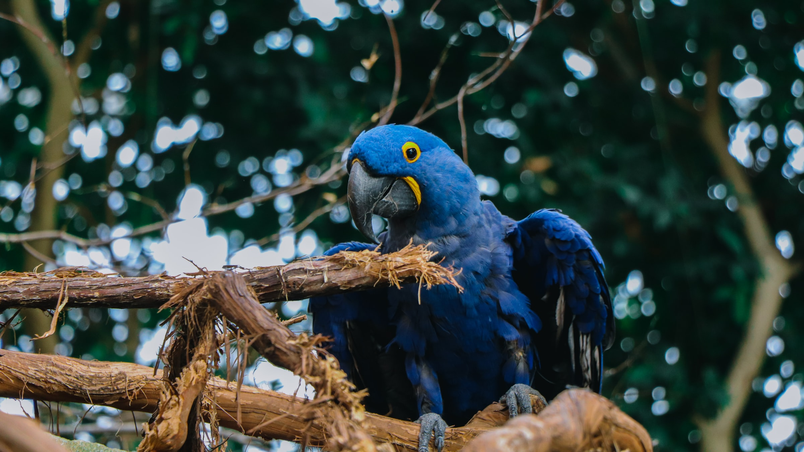

One early morning my friend Deendayal and I  were sitting under a mango tree in a dense forest. The wind was blowing , caressing me like my  mother’s gentle pat making me forget about my homework, timetable, bullies, insults, griefs, worries, and almost everything. Trees were waving their branches in the concert of birds and flowers were opening up their bloom shops,  welcoming  pollinators for a feast. The God’s sun walks the sky with his heavenly guards and distributes light to its disciples. And like this dawn arrives. 

Deendayal was pleased with the soothing breeze of happiness floating over the chirping of birds. The beauty of nature leads him to praise nature ‘Is it possible  to capture all this in a box?, I asked out of fascination. ‘In that case will nature’s nature be real?’ he replied, looking up into the sky. 

His words made me travel through a deep well of thoughts.

He said pointing towards a parrot sitting on a guava tree,’Look at that parrot!There are certain reasons for which God has created it the way it is.’ I was listening to him attentively. ‘There are reasons behind its color, hookbill beak and its feather’.I said to him, ‘I didn’t get your point’ He explained further,’I’m trying to convey that the parrot’s  color helps it camouflage with  its environment hiding from its predators, his hookbill shaped beak helps it in climbing trees and  crushing fruits. Its feathers help it in maintaining its body temperature. These features of the parrots would lose its importance in that box. No matter how luxurious that enclosure be; it will always remain a prison for the creature.’ His words were blowing like a wind opening the window of my mind , through the window scattered the light of thoughts waking me up from the illusion of happiness. ‘God is an artist!’ he said in a  thoughtful tone

‘Everyone has its own role in this world. The almighty creator has connected everyone to a chain of nature, and if one connected to that chain trembles others too would lose their balance.’What are you talking about?’I enquired. ‘I’m trying  to tell you that everyone is interdependent in nature. Like this parrot gets fruits to eat from the forest and in return it disperses the seeds all over the jungle and adds manure to the soil; It is the gardener of this huge forest. It also leaves some morsels for ants in its wake and makes holes in the fruits so that insects like flies or honeybees, which cannot pierce the fruit skin by themselves can have it. When they are kept in a cage where they have sufficient food, water and the love of its master, still it cannot be satisfied with its life. The parrot will be removed from this chain but will always be behind  bars. They are incomplete without the forest like an awesome beat without lyrics.’, he elaborated.

I was pushed  into a confounding reverie by his words. I gave a gentle pat on his shoulder and we both sat in the silence of understanding for a while.

 The morning had now evolved into afternoon and the light of thoughts had now turned into the light of realization. We rode back to our homes swerving through the city hustling for money and fame with a hope that it will bring peace in their lives. Unaware of the fact that you don’t always have to achieve happiness. Life has its own beauty. Why aren’t  we exploring that? Why are we battling to own happiness? God is an artist and only an artist could read the stories that he weaves.

